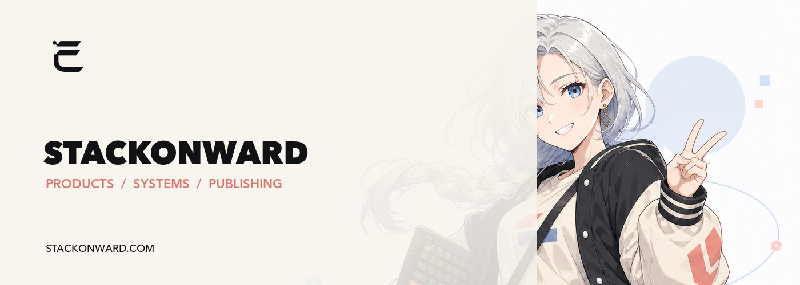
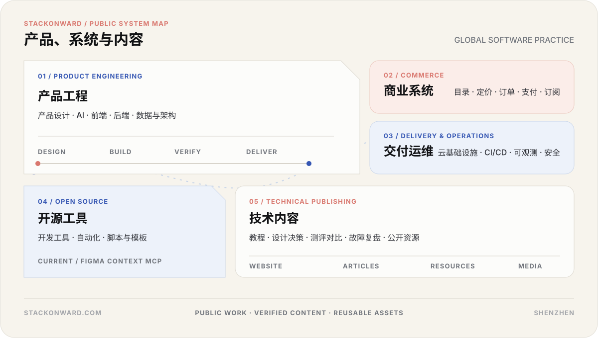
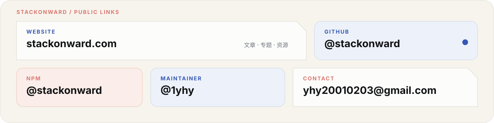
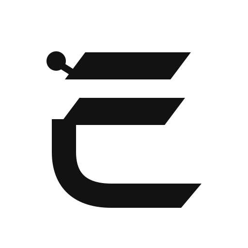

  

<h1 align="center">远栈 StackOnward</h1>

  <strong>软件产品、工程系统与技术内容。</strong>

  
  
  
  
  

---

围绕全球化软件产品，内容覆盖产品工程、商业系统、交付运维与增长基础设施。

  

## 开源项目

### [Figma Context MCP](https://github.com/1yhy/Figma-Context-MCP)

连接 Figma 设计上下文与 AI 编程工具，提供布局识别、样式提取、资源导出和低 Token 数据访问。

  
  
  
  

`TypeScript` · `Model Context Protocol` · `Figma API` · `Design to Code`

## 最新内容

远栈网站公开发布的技术文章。

<!-- BLOG-POST-LIST:START -->
- [Claude Code Hooks 怎么用：把确定性检查接入 Claude Code 与 Codex](https://stackonward.com/posts/claude-code-codex-hooks/) · 2026-09-05
- [Agent Skill 怎么写：把重复工作流接入 Claude Code 与 Codex](https://stackonward.com/posts/agent-skill-project-workflow/) · 2026-09-05
- [AI Coding 提示词怎么写：只写当前任务，不重复项目规则](https://stackonward.com/posts/coding-agent-task-prompt/) · 2026-09-04
- [AGENTS.md 怎么写：根规则、目录规则与 CLAUDE.md 复用](https://stackonward.com/posts/agents-md-claude-md-project-rules/) · 2026-09-04
- [Claude Code 与 Codex 配置怎样协同：全局、项目、Prompt、Skill 与 Hook](https://stackonward.com/posts/claude-code-codex-configuration-guide/) · 2026-09-04
<!-- BLOG-POST-LIST:END -->

## 公开入口

  

  <a href="https://stackonward.com/">Website</a>
  ·
  <a href="https://github.com/stackonward">GitHub</a>
  ·
  <a href="https://www.npmjs.com/org/stackonward">npm</a>
  ·
  <a href="https://github.com/1yhy">Maintainer</a>
  ·
  <a href="mailto:yhy20010203@gmail.com">Contact</a>

  

